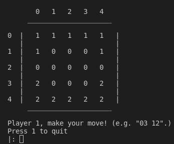
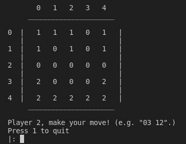

# Trabalho Prático 2 - Programação Funcional e em Lógica

## Instalação e Execução
### Linux

Executar o programa *sicstus 4.7.0*.

Executar o comando `consult()` com o caminho absoluto para o ficheiro `src/play.pl`, e de seguida executar o predicado de inicio de jogo através do comando `play.`

### Windows

Executar o programa *spwin.exe*.

Executar o comando `consult()` com o caminho absoluto para o ficheiro `src/play.pl`, e de seguida executar o predicado de inicio de jogo através do comando `play.`

## Descrição do jogo - Five Field Kono

Five Field Kono é um jogo tradicional Coreano que é jogado por 2 jogadores, cada um com 7 peças, num tabuleiro quadrado de 5x5.

Cada peça pode mover-se um quadrado na diagonal, e não há capturas nem saltos. O objetivo do jogo é mover as 7 peças até ao lado contrário do tabuleiro, onde as peças do adversário estavam no inicio do jogo. 
O primeiro jogador a realizar esta tarefa ganha o jogo. 

## Lógica do Jogo

Nesta secção vai ser explicado detalhadamente a implementação da lógica do jogo *Five Field Kono* em Prolog.

### Representação interna do estado do jogo

Para a representação poder ser a mais evidente possível para o utilizador, decidimos representar o Jogador 1 pelo carater *1* e o Jogador 2 pelo carater *2*.

Assim sendo os tabuleiros, que são de dimensões 5*5, terão a representação apresentada a seguir:

* Tabuleiro Inicial
  
``` 
startBoard(
    [
    [1, 1, 1, 1, 1],
    [1, 0, 0, 0, 1],
    [0, 0, 0, 0, 0],
    [2, 0, 0, 0, 2],
    [2, 2, 2, 2, 2]
    ]
).
```

* Exemplo de Tabuleiro Intermédio

```
gameState(
    [
    [1, 0, 1, 1, 1],
    [1, 0, 1, 0, 0],
    [0, 2, 0, 1, 0],
    [0, 0, 2, 0, 2],
    [2, 0, 2, 2, 2]
    ]
).
```

* Exemplo de Tabuleiro Final com o Jogador 1 vencedor
  
```
endBoard1(
    [
    [2, 2, 0, 0, 2],
    [2, 2, 0, 0, 2],
    [0, 0, 0, 2, 0],
    [1, 0, 0, 0, 1],
    [1, 1, 1, 1, 1]
    ]
).
```

* Exemplo de Tabuleiro Final com o Jogador 2 vencedor 

```
endBoard2(
    [
    [2, 2, 2, 2, 2],
    [2, 0, 0, 0, 2],
    [0, 1, 0, 1, 0],
    [0, 0, 1, 0, 0],
    [1, 0, 1, 1, 1]
    ]
).
```
Estes exemplos de tabuleiros estão também presentes no ficheiro *board.pl*.

### Visualização do estado de jogo

Os predicados de visualização do jogo estão implementado em diferentes ficheiros, entre os quais os ficheiros *view.pl* e *menus.pl*.

* Menus

Os menus implementados estão presentes no ficheiro *menus.pl*.
Foram implementados dois menus, um de inicio de jogo, `mainMenu`, e um quando o jogo termina, `gameOverMenu(+Winner)`. 

O menu de inicio de jogo premite ao utilizador escolher que tipo de jogo pretende fazer. Posto isto, disponibilizamos 3 opções: Jogador vs Jogador, Jogador vs Computador ou Computador vs Computador.

Em relação ao menu de fim de jogo, este simplesmente mostra uma mensagem com a informação do jogador que venceu. 

A seguir mostramos imagens dos menus que foram implementados.


Fig. 1 - Menu de inicio de jogo com as configurações necessárias


Fig. 2- Menu de final de jogo com a informação do jogador vencedor

* Visualização do Tabuleiro

O predicado de visualização do tabuleiro chama-se `display_game(+GameState)` e está presente no ficheiro *view.pl*.

Este predicado é de implementação muito simples. Consiste basicamente em percorrer o Tabuleiro e imprimir os dados do mesmo no ecrã. Este predicado tem como predicados auxiliares `showRow`, `showCol` e `cls`.
Os dois primeiros são usados para percorrer o tabuleiro para posteriormente imprimir no ecrã. O terceiro, `cls`, vai fazer um *clean* da consola de modo ao usuário ter uma melhor experiência de jogo.

A seguir é mostrada uma imagem com um exemplo do tabuleiro de jogo.



Fig. 3 - Exemplo de tabuleiro com a informação do jogador atual e com possibilidade de *input* de jogada

* Interação com o Jogador
  
As interações com o utilizador estão presentes num outro ficheiro chamado *user.pl*.
Nele estão contidos diversos predicados essenciais ao jogo. 

O predicado `getMove(-Move, +Player)` recebe o input do utilizador, verificando se está de acordo com o pretendido através do predicado `validateInput(+Input, -IsValid)`. 

O predicado que valida o input, `validateInput(+Input, -IsValid)`, irá verificar se a jogada recebida pelo utilizador está na forma `"00 11".`. Caso seja um input inválido, como `"1111111".`, o jogo irá pedir um novo input ao jogador. Este predicado também verifica se o input fornecido está dentro dos limites do Tabuleiro (5*5), e inputs que não estejam entre 0 e 4 serão também rejeitados. 

Posteriormente vai ser feita uma validação do movimento escolhido pelo utilizador através do predicado `validateMove(+GameState, +Player, +Move, -IsValid)`. Aqui, vai ser verificado se o movimento é possível, ou seja, se a peça pretence ao jogador atual e se o destino da peça está vazio. Também verifica se o movimento é feito uma casa na diagonal.

Se as condições de validação se verificarem é então processado o input e retornado o movimento através do predicado `process(+Input, -Move)`.
Neste ponto vai ser convertido o input na forma `"00 11".` para uma lista com duas listas de inteiros: `[[0, 0], [1, 1]]`. 

### Execução de Jogadas

O código referente à lógica em si do jogo está presente no ficheiro *game.pl*, nele podemos encontrar diversos predicados essenciais ao funcionamento do jogo, entre os quais o predicado `move(+GameState, +Player, +Move, -NewGameState)`.
Este predicado fará a execução de uma jogada e retorna o tabuleiro atualizado.

Posto isto, decidimos representar movimentos através de uma lista de inteiros.

```
Move = [[0, 3], [1, 2]]
```

Em cima, está representado um possível movimento executado pelo utilizador.

O primeiro elemento da lista corresponde à posição inicial do movimento a executar, e o segundo elemento ao destino do movimento.
Mostramos, nas figuras em baixo como é que o movimento muda a posição das peças no Tabuleiro.


Fig. 4 - Representação do Tabuleiro antes de ser efetuado o movimento



Fig. 5 - Representação do Tabuleiro após a execução da uma jogada

### Final do Jogo

A deteção de final do jogo está presente no ficheiro *game.pl*.

A implementação consiste no seguinte predicado `game_over(+GameState, -Winner)` que verifica se as condições de final de jogo se verificam. O jogo termina quando um dos jogadores tiver as peças na posição inicial do adversário. Temos exemplos de Tabuleiros que representam esta situação de jogo presentes na secção *Representação interna do estado do jogo* deste relatório.

Caso as condições de final de jogo se verifiquem, é chamado o `gameOverMenu(+Winner)`. Esta chamada é feita dentro do *loop* principal do jogo, presente no ficheiro *play.pl*.
Assim sendo, o jogo é terminado, sendo apenas mostrado este menu.

### Jogada do Computador

Em relação ao jogo contra o computador, foi apenas implementado a jogada aleatória, ou seja, o nível um de jogo. 

O código referente à jogada do computador está presente no ficheiro *computer.pl*, e o predicado que calcula e executa a jogada chama-se `choose_move(+GameState, +Level, +Player, -Move)`. 

O predicado começa por escolher inteiro aleatórios entre 0 e 4, que são as dimensões do tabuleiro. Posteriormente verifica se a posição encontrada pretence a uma peça do computador, caso não se verifique tenta encontrar outra posição. Caso encontre uma peça que pode ser jogada, é feita outra escolha aleatória para onde a peça se deverá mover. 

Posteriormente, é usado o predicado `validateMove(+GameState, +Player, +Move, -IsValid)`, cujo funcionamento já foi descrito na secção *Interação com o Jogador*. Basicamente é verificado se a jogada escolhida aleatóriamente é válida, e caso contrário é pedido novamente um outro movimento.

## Conclusões

Com o desenvolvimento deste projeto, foi possível desenvolver as nossas competências em relação à linguagem de *PROLOG*.
Consideramos também que o projeto foi bastante interessante de desenvolver.

### Problemas do trabalho desenvolvido

Não foi implementado a lista de jogadas válidas, tal como era pedido no enunciado. Fizemos esta decisão por falta de tempo e porque no ficheiro *user.pl* tinhamos já implementado um predicado que verificava se o movimento introduzido pelo utilizador seria válido ou não. Por as razões enunciadas, decidimos não implementar a lista de jogadas válidas.

### Possíveis melhorias

Uma das possíveis melhorias que poderíamos ter feito ao nosso projeto seria a parte da Jogada de Computador. Por falta de tempo tivemos de nos contentar com a jogada aleatória de nível 1.

Para além disso, uma possível melhoria passa por fazer o jogo mais apelativo ao utilizador, melhorando o display do Tabuleiro e principalmente a forma como o input é processado para o jogo.
O utilizador para realizar uma jogada terá de inserir inputs da forma, `"00 11".`, o que poderá não ser muito intuitivo para a maioria.

Por fim, em relação às dimensões do Tabuleiro, não foi implementado no nosso trabalho nenhuma *feature* para tornar as dimensões do mesmo configuráveis pelo utilizador.

## Bibliografia

[Sicstus](https://sicstus.sics.se/sicstus/docs/latest4/html/sicstus.html/)

[SWI-Prolog](https://www.swi-prolog.org/)

[Five Field Kono](https://boardgamegeek.com/boardgame/25471/five-field-kono)

### Projeto desenvolvido por:

Sofia Teixeira up201806629

Mónica Pereira up201905753